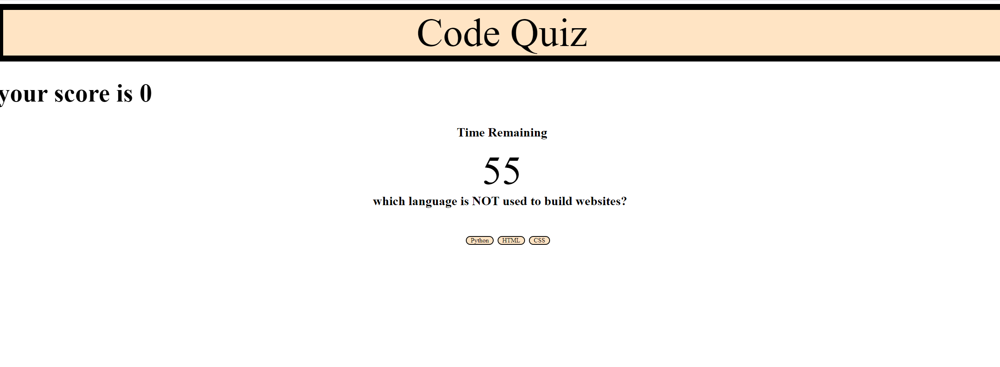

# CodeQuiz

## summary of assignment
-we were tasked with making an interactive quiz that would ask questions of the user pertaining to coding

## languages used
-HTML was used as the main skeleton for the page
-CSS was used to add different styles to the elements on the page
-Javascript was used to add in new elements and make them interactible 

## preview of the site



## code snippet 
```javascript
function startTimer() {
  timer = setInterval(function() {
    
    timerCounter--;

    timerAmount.textContent = timerCounter;
    
    if (timerCounter <= 0 || i >= "3" ) {
      clearInterval(timer)
      
      allTime.innerHTML = "";
      question.innerHTML = "";
      
    
      
      gameOverContainer.appendChild(initial)
      gameOverContainer.appendChild(submitButton)
      gameOverContainer.appendChild(gameOver)

    }
      
 }, 1000);
```

## My Links
[Github](https://github.com/SerenaChandler),
[Linkedin](https://www.linkedin.com/in/serena-chandler-b62a39204/)

